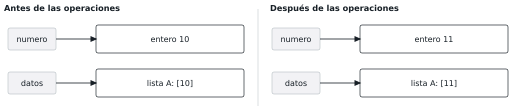
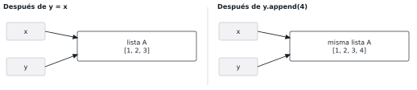
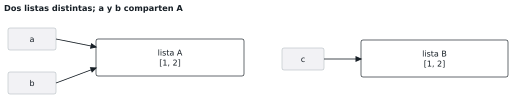
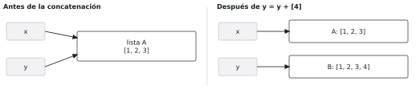
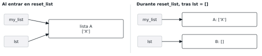
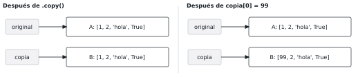
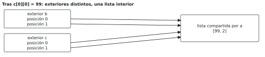
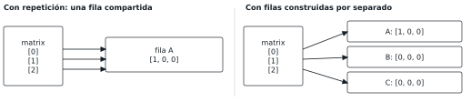
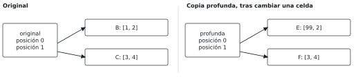
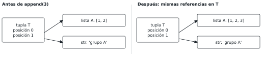

# Objetos y referencias en memoria

Estructura y Organización de Datos | Python | Etapa 1

Guía de aprendizaje autónomo. Edición 1.0, septiembre de 2026.

[Descargar el PDF imprimible](output/pdf/guia_objetos_referencias.pdf)

Lee, predice y dibuja antes de ejecutar. Conserva tu predicción, compara la salida y explica cualquier diferencia. Cada programa debe ejecutarse desde su inicialización. No se piden valores numéricos concretos de `id()`.

## Preparación

Python 3.10 o posterior. Los programas del estudiante no necesitan paquetes externos. Desde esta carpeta: `python3 ejercicios/e05.py` (macOS/Linux) o `py ejercicios/e05.py` (Windows).

Los diagramas usan etiquetas simbólicas A, B y C, sin representar direcciones ni ubicaciones físicas. Los contenidos de los contenedores se abrevian.

## 1.1 Objetos, tipos y mutabilidad

**Meta:** Distinguir entre modificar un objeto y obtener un valor distinto, e identificar los tipos mutables habituales.

**Pregunta inicial:** Si un número es inmutable, ¿por qué podemos escribir n = n + 1?

En Python los datos se representan mediante objetos. Un objeto tiene un tipo, un valor y una identidad. El tipo determina qué operaciones admite; el valor describe su contenido o estado. La identidad permite distinguirlo de otros objetos y la estudiaremos en 1.3.

Un objeto mutable admite cambios en su estado después de crearse. Un objeto inmutable conserva su estado. Esta propiedad corresponde al objeto: una variable puede pasar a nombrar otro objeto. Por eso n = n + 1 es válido aunque los enteros sean inmutables.

| Mutables | Inmutables |
| --- | --- |
| list, dict, set | int, float, bool, str, tuple |
| Consulta adicional: bytearray | Consulta: complex, bytes, range, frozenset |

### Ejemplo resuelto D01

[Archivo](ejemplos/d01.py)

```python
numero = 10
numero = numero + 1
datos = [10]
datos[0] = 11
print(numero)
print(datos)
```

Salida:

```text
11
[11]
```

La suma obtiene el valor 11 y numero queda asociado al entero correspondiente. No modifica al entero 10. En cambio, datos[0] = 11 cambia qué elemento ocupa la primera posición de la misma lista; no modifica al entero que antes estaba allí.



**Observa:** Cambiar una variable no demuestra que el objeto anterior sea mutable. Una cadena admite operaciones como upper(), pero estas no modifican la cadena original.

### Resuelve en papel

#### E01: Una operación sobre una cadena

[Archivo](ejercicios/e01.py)

```python
texto = "hola"
mayusculas = texto.upper()
print(texto)
print(mayusculas)
```

1. Escribe las dos líneas de salida.
2. ¿Se modificó la cadena a la que se refiere texto? Explica.

#### E02: Modificar un diccionario

[Archivo](ejercicios/e02.py)

```python
alumno = {"nombre": "Ana", "edad": 18}
alumno["edad"] = 19
print(alumno["nombre"])
print(alumno["edad"])
```

1. Escribe la salida y señala qué objeto cambió.
2. Clasifica int, str, list, tuple, dict y set por mutabilidad.

**Una variación:** En e01, sustituye la asignación a mayusculas por texto = texto.upper() y muestra solo texto. ¿Cambiaría la mutabilidad de str?

### Respuestas razonadas (después del intento)

**E01**

```text
hola
HOLA
```

upper() produce el resultado en mayúsculas; texto conserva su asociación con la cadena original. La operación no modifica esa cadena.

**E02**

```text
Ana
19
```

El diccionario es mutable: cambia el valor asociado a la clave edad. No se transforma el entero 18 en 19 ni cambia el valor asociado a nombre. Clasificación: int, str y tuple son inmutables; list, dict y set son mutables.

**La variación:** Se imprimiría HOLA. str seguiría siendo inmutable: texto quedaría asociado a la cadena resultante.

**Antes de avanzar:** Puedo explicar por qué asignar un nuevo valor a una variable no cambia la mutabilidad de su objeto anterior.

## 1.2 Variables, asignación y referencias

**Meta:** Representar nombres que comparten un objeto y explicar por qué una asignación no lo copia.

**Pregunta inicial:** Al escribir y = x, ¿aparece otra lista o aparece otro nombre para la misma lista?

Una variable es un nombre vinculado a un objeto. Llamaremos referencia a la relación que permite llegar a ese objeto. En x = [1, 2, 3] se crea una lista y x queda asociado a ella. En y = x se evalúa x y se vincula y al mismo objeto.

La asignación no copia automáticamente el objeto. Dos nombres que llegan al mismo objeto son alias. Si modificamos ese objeto mediante uno de ellos, el cambio se observa también a través del otro. Esto no exige que uno de los nombres se actualice o envíe datos al otro.

### Ejemplo resuelto D02

[Archivo](ejemplos/d02.py)

```python
x = [1, 2, 3]
y = x
y.append(4)
print(x)
print(y)
```

Salida:

```text
[1, 2, 3, 4]
[1, 2, 3, 4]
```

Después de y = x hay una sola lista. append(4) agrega un elemento a esa lista. Los dos print recorren el mismo objeto y muestran su estado actualizado.



**Observa:** Un diagrama con dos nombres no implica dos objetos. Cuenta las cajas de objetos y sigue las flechas. Las etiquetas A y B de nuestros dibujos son simbólicas, nunca direcciones reales.

### Resuelve en papel

#### E03: Una tercera referencia

[Archivo](ejercicios/e03.py)

```python
a = [7]
b = a
c = b
c.append(8)
print(a)
print(b)
print(c)
```

1. Predice la salida y dibuja los tres nombres.
2. ¿Cuántas listas se han creado?

#### E04: La misma asignación con enteros

[Archivo](ejercicios/e04.py)

```python
a = 7
b = a
b = b + 1
print(a)
print(b)
```

1. Escribe la salida y dibuja las referencias al final.
2. ¿Se modificó el entero 7?

**Una variación:** En e03, cambia solamente b = a por b = [7]. Mantén c = b. Predice las tres salidas y dibuja las listas que existirán.

### Respuestas razonadas (después del intento)

**E03**

```text
[7, 8]
[7, 8]
[7, 8]
```

a, b y c se refieren a una única lista. c.append(8) la modifica. Las asignaciones b = a y c = b no crean listas adicionales.

**E04**

```text
7
8
```

Tras b = a ambos nombres se refieren al mismo entero. La última asignación vincula b al entero 8; a conserva su referencia al 7. La regla de asignación es la misma que con listas.

**La variación:** Las salidas serían [7], [7, 8] y [7, 8]. a se refiere a una lista; b y c comparten una segunda lista creada por [7].

**Antes de avanzar:** Puedo distinguir el número de nombres del número de listas y explicar por qué compartir una lista propaga la observación de sus cambios.

## 1.3 Identidad e igualdad

**Meta:** Anticipar si dos expresiones se refieren al mismo objeto sin depender de números de identidad concretos.

**Pregunta inicial:** ¿Dos listas que imprimen lo mismo tienen que ser la misma lista?

Para las listas de estos ejemplos, == compara sus contenidos; is comprueba si ambas expresiones se refieren al mismo objeto. Dos listas distintas pueden ser iguales. Podemos compartir una lista mediante asignación o crear dos listas separadas con el mismo contenido.

id(objeto) devuelve un entero que identifica al objeto durante su vida. En CPython coincide con una dirección de memoria; eso es un detalle de esa implementación. Los valores concretos no son una respuesta fija entre ejecuciones. Aquí solo anticiparemos coincidencias o diferencias entre objetos que existen al mismo tiempo.

### Ejemplo resuelto D03

[Archivo](ejemplos/d03.py)

```python
a = [1, 2]
b = a
c = [1, 2]
print(a == c)
print(a is c)
print(a is b)
print(id(a) == id(b))
```

Salida:

```text
True
False
True
True
```

a y b comparten una lista. c se refiere a otra lista con los mismos elementos. Por eso el contenido de a y c es igual, pero sus identidades son diferentes. Comparar los id de a y b confirma que se trata del mismo objeto.



**Observa:** Usa == para comparar valores. No bases una regla general en is con números o cadenas literales: Python puede reutilizar ciertos objetos inmutables. Un id puede reutilizarse cuando el objeto anterior ya no existe.

### Resuelve en papel

#### E05: Tres comparaciones

[Archivo](ejercicios/e05.py)

```python
a = [5]
b = [5]
c = a
print(a == b)
print(a is b)
print(b is c)
print(id(a) == id(c))
```

1. Predice cada booleano; no escribas direcciones.
2. Dibuja las listas y escribe qué nombres comparten identidad.

#### E06: Objetos vacíos

[Archivo](ejercicios/e06.py)

```python
x = []
y = x
z = []
print(x == z)
print(x is y)
print(id(y) == id(z))
```

1. Escribe la salida.
2. ¿Sería válido exigir un número específico como respuesta a id(x)?

**Una variación:** En e05 cambia únicamente c = a por c = b. ¿Cuáles de las cuatro respuestas cambian?

### Respuestas razonadas (después del intento)

**E05**

```text
True
False
False
True
```

a y c llegan a una lista; b llega a otra. Las listas tienen el mismo contenido. La última comparación es True porque a y c identifican al mismo objeto vivo.

**E06**

```text
True
True
False
```

Cada expresión [] crea una lista nueva. x y z son listas vacías iguales; y comparte la de x. Las dos listas están vivas y sus id son distintos.

**La variación:** La salida pasa a True, False, True, False. Cambian la tercera y la cuarta comparación. No es válido exigir un id numérico fijo en e06: lo relevante es la relación de identidad.

**Antes de avanzar:** Puedo justificar cada comparación siguiendo referencias, sin memorizar números de id ni confundir == con is.

## 1.4 Mutación y reasignación

**Meta:** Identificar el objeto afectado por una operación y distinguir cambios de contenido de cambios de asociación.

**Pregunta inicial:** ¿Por qué y.append(4) y y = y + [4] pueden producir efectos diferentes sobre x?

Mutar es modificar el estado de un objeto existente. Reasignar un nombre es vincularlo a otro objeto. Una lista admite mutación mediante append(), clear() y asignaciones por índice. En cambio, y = [] cambia la asociación del nombre y.

Con listas incorporadas, + crea una lista nueva y += extiende la lista existente. Con enteros, += obtiene un resultado y reasigna el nombre. No memorices += como sinónimo universal de una de estas conductas: identifica el tipo y la operación.

### Ejemplo resuelto D04

[Archivo](ejemplos/d04.py)

```python
x = [1, 2, 3]
y = x
y = y + [4]
print(x)
print(y)
print(x is y)
```

Salida:

```text
[1, 2, 3]
[1, 2, 3, 4]
False
```

La expresión y + [4] construye otra lista. La asignación mueve la referencia de y a esa lista. x continúa asociado a la primera. En y[0] = 9, en cambio, el nombre y no se reasigna: cambia un elemento de la lista a la que llega.



**Observa:** x.clear() vacía una lista existente; x = [] vincula x a una lista nueva. Además, append() y clear() devuelven None: escribir x = x.append(4) hace perder a x su referencia a la lista.

### Resuelve en papel

#### E07: La suma aumentada sobre una lista

[Archivo](ejercicios/e07.py)

```python
x = [1, 2]
y = x
y += [3]
print(x)
print(y)
print(x is y)
```

1. Predice las tres salidas.
2. Contrasta este caso con el ejemplo resuelto de la sección.

#### E08: Vaciar y después reasignar

[Archivo](ejercicios/e08.py)

```python
x = [1, 2]
y = x
y.clear()
y = [9]
print(x)
print(y)
print(x is y)
```

1. Dibuja el estado tras clear() y el estado final.
2. Identifica cuál línea muta y cuál reasigna.

**Una variación:** Sustituye y += [3] por y = y + [3] en e07. Después compara a = 10; b = a; b += 3. Explica ambos casos.

### P01: Identidad y cambios de estado

Comprobar la diferencia entre extender una lista compartida, construir otra lista y reasignar un entero.

[Programa inicial](practicas/p01.py)

```python
x = [1, 2]
y = x
y += [3]
a = 10
b = a
b += 3
print(x)
print(x is y)
print(a, b)
```

1. Escribe la salida prevista y dibuja las referencias antes de ejecutar el programa inicial.
2. Ejecuta el archivo y conserva tu predicción. Registra cualquier diferencia y su explicación.
3. Variante A: cambia solo y += [3] por y = y + [3]. Predice y ejecuta de nuevo desde el inicio.
4. Variante B: haz que x y y terminen vacías y sigan siendo la misma lista. Decide entre y.clear() y y = []. Comprueba tu elección.

### Respuestas razonadas (después del intento)

**E07**

```text
[1, 2, 3]
[1, 2, 3]
True
```

Para list, += extiende la lista existente. Los dos nombres siguen llegando a ella; por eso cambia lo que se observa desde x y la identidad compartida se conserva.

**E08**

```text
[]
[9]
False
```

clear() primero vacía la lista compartida. Después y = [9] crea otra lista y cambia únicamente la asociación de y. x sigue llegando a la lista vacía.

**La variación:** La variante de listas imprime [1, 2], [1, 2, 3] y False: + construye una lista nueva. Con enteros, a sigue siendo 10 y b queda asociado al 13. El entero 10 no se modifica.

**Antes de avanzar:** Puedo señalar si una instrucción cambia un objeto, una posición del contenedor o la asociación de un nombre.

### Revisión de P01

Inicial: x queda [1, 2, 3], x is y es True y los enteros se muestran como 10 13.

Variante A: se imprime [1, 2], False y 10 13. + construye otra lista y la asignación cambia la referencia de y.

Variante B: clear() satisface las dos condiciones. Para comprobar contenidos e identidad también puedes imprimir y y comparar id(x) == id(y); el booleano debe ser True.

[Solución de referencia](soluciones/s01.py)

```python
x = [1, 2]
y = x
y.clear()
a = 10
b = a
b += 3
print(x)
print(x is y)
print(a, b)
```

Salida:

```text
[]
True
10 13
```

clear() vacía el objeto compartido. y = [] no cumpliría la condición: dejaría x intacta y separaría los nombres.

## 1.5 Referencias en funciones

**Meta:** Explicar los efectos de mutar un argumento o reasignar un parámetro local, y recuperar resultados mediante return.

**Pregunta inicial:** ¿Por qué una función puede agregar elementos a tu lista, pero lst = [] no la vacía?

Al llamar una función, sus parámetros se vinculan a los objetos recibidos. Python pasa argumentos por asignación: el parámetro es un nombre local que puede compartir objeto con un nombre del código que llama. La regla es la misma para listas, diccionarios, enteros y cadenas.

Mutar un objeto compartido permite observar el cambio desde fuera de la función. Reasignar el parámetro cambia solo su asociación local. Si la función obtiene otro objeto que el llamador necesita, puede devolverlo con return; el llamador decide a qué nombre asociarlo.

### Ejemplo resuelto D05

[Archivo](ejemplos/d05.py)

```python
def add_item(lst):
    lst.append("X")

def reset_list(lst):
    lst = []

my_list = []
add_item(my_list)
reset_list(my_list)
print(my_list)
```

Salida:

```text
['X']
```

add_item vincula lst a la lista de my_list y la modifica. En reset_list, lst inicialmente llega a esa misma lista, pero lst = [] lo vincula a otra. my_list conserva su referencia. Al acabar cada llamada, el nombre local lst no se convierte en un nombre del llamador.



**Observa:** El comportamiento no significa que las listas se pasen de una forma y los enteros de otra. Cambia lo que admite cada objeto. Una función sin return explícito devuelve None.

### Resuelve en papel

#### E09: Reasignar dentro de la función

[Archivo](ejercicios/e09.py)

```python
def modify(lst):
    lst = lst + [99]

numbers = [1, 2, 3]
modify(numbers)
print(numbers)
```

1. Escribe la salida y dibuja las dos listas durante la llamada.
2. ¿Qué cambiaría si la función utilizara lst.append(99)?

#### E10: Actualizar y reiniciar un diccionario

[Archivo](ejercicios/e10.py)

```python
def update_dict(d):
    d["key"] = "value"

def reset_dict(d):
    d = {}

my_dict = {}
update_dict(my_dict)
reset_dict(my_dict)
print(my_dict)
```

1. Identifica la mutación y la reasignación local.
2. Propón una línea que permita a reset_dict vaciar el diccionario recibido.

**Una variación:** En e09, haz que la función devuelva lst + [99]. Compara llamar modify(numbers) sin guardar el resultado y escribir numbers = modify(numbers).

### P02: Modificar, reasignar y devolver

Controlar si una función cambia la lista recibida o entrega otra lista al llamador.

[Programa inicial](practicas/p02.py)

```python
def agregar_final(datos):
    datos = datos + [99]

original = [1, 2]
resultado = agregar_final(original)
print(original)
print(resultado)
```

1. Predice original y resultado. Distingue las listas a las que llegan original y datos justo después de la asignación dentro de la función.
2. Variante A: cambia el cuerpo por datos.append(99), sin añadir return. Predice original y resultado.
3. Variante B: conserva original intacta y devuelve una lista con 99 al final. Guarda el retorno en resultado y compara su identidad con original.
4. En la variante B, cambia la llamada a agregar_final(original) sin asignarla. Explica qué lista continúa disponible mediante original.

### Respuestas razonadas (después del intento)

**E09**

```text
[1, 2, 3]
```

lst + [99] construye otra lista. La asignación solo vincula el parámetro local a ella; numbers sigue asociado a la lista inicial.

**E10**

```text
{'key': 'value'}
```

update_dict cambia el diccionario compartido. reset_dict solo reasigna su parámetro d. Al retornar, my_dict sigue llegando al diccionario con la entrada key.

**La variación:** Sin guardar el retorno, numbers conserva [1, 2, 3]. Al asignarlo, numbers queda asociado a [1, 2, 3, 99]. La variante append(99) mutaría la lista original. En e10, d.clear() la vaciaría sin reasignar d.

**Antes de avanzar:** Puedo distinguir la modificación de un argumento de la reasignación de su parámetro y explicar cuándo debo usar el resultado devuelto.

### Revisión de P02

Inicial: aparecen [1, 2] y None. Justo después de reasignar datos, original llega a [1, 2] y el parámetro local datos llega a otra lista, [1, 2, 99].

Variante A: original pasa a [1, 2, 99]; resultado sigue siendo None porque append() no añade un return a la función.

Variante B: el código de solución devuelve otra lista. Si se ignora el retorno, original conserva [1, 2] y no se guarda un nombre para la lista resultante.

[Solución de referencia](soluciones/s02.py)

```python
def agregar_final(datos):
    return datos + [99]

original = [1, 2]
resultado = agregar_final(original)
print(original)
print(resultado)
print(original is resultado)
```

Salida:

```text
[1, 2]
[1, 2, 99]
False
```

return entrega la lista nueva al llamador. resultado queda asociado a ella y original conserva la primera.

## 1.6 Copias de listas simples

**Meta:** Distinguir una asignación de una copia superficial y comprobar qué cambios quedan aislados en listas simples.

**Pregunta inicial:** ¿Qué diferencia existe entre copia = original y copia = original.copy()?

original.copy() crea otra lista. Esa nueva lista comienza con referencias a los mismos elementos que la primera. Se llama copia superficial: se crea el contenedor exterior, pero no se copian recursivamente los objetos que contiene.

Para listas, original[:] también crea una copia superficial. Si sus elementos son enteros, cadenas o booleanos, sustituir una posición en la copia no cambia el contenedor original. Esto no transforma los enteros ni las cadenas; cambia una referencia dentro de la lista nueva.

### Ejemplo resuelto D06

[Archivo](ejemplos/d06.py)

```python
original = [1, 2, "hola", True]
copia = original.copy()
copia[0] = 99
print(original)
print(copia)
print(original is copia)
```

Salida:

```text
[1, 2, 'hola', True]
[99, 2, 'hola', True]
False
```

Se crean dos listas distintas. Cambiar la posición 0 de copia no altera la posición 0 de original. Las posiciones restantes pueden seguir refiriéndose a los mismos objetos inmutables; eso no impide que las listas sean distintas.



**Observa:** El nombre copia no garantiza una copia. copia = original sigue siendo una asignación. Tampoco basta decir 'los elementos son inmutables' si un elemento es una tupla que contiene una lista: revisaremos ese caso en 1.10.

### Resuelve en papel

#### E11: Una copia y un alias

[Archivo](ejercicios/e11.py)

```python
original = [10, 20]
copia = original.copy()
alias = original
copia.append(30)
alias[0] = 99
print(original)
print(copia)
```

1. Predice la salida y dibuja las dos listas.
2. ¿Qué nombres comparten identidad?

#### E12: Copiar mediante un corte

[Archivo](ejercicios/e12.py)

```python
a = ["A", "B"]
b = a[:]
print(a == b)
print(a is b)
b.clear()
print(a)
print(b)
```

1. Escribe cada línea de salida.
2. ¿Por qué vaciar b no vacía a?

**Una variación:** En e12 sustituye b = a[:] por b = a. Predice nuevamente todos los resultados.

### Respuestas razonadas (después del intento)

**E11**

```text
[99, 20]
[10, 20, 30]
```

copia es otra lista y recibe el 30. alias comparte la lista de original y cambia su primera posición. Cada modificación afecta un contenedor distinto.

**E12**

```text
True
False
['A', 'B']
[]
```

a[:] construye otra lista con los mismos elementos. Inicialmente los contenidos coinciden. clear() vacía únicamente la lista a la que se refiere b.

**La variación:** Se imprimirían True, True, [] y []. b sería un alias de a y clear() vaciaría la única lista. En e11, original y alias comparten identidad.

**Antes de avanzar:** Puedo elegir entre compartir una lista y crear otra lista cuando necesito modificar su contenedor por separado.

## 1.7 Anidamiento y copia superficial

**Meta:** Seguir referencias por varios niveles y distinguir la sustitución de una fila de la mutación de esa fila.

**Pregunta inicial:** ¿Por qué una copia distinta puede seguir compartiendo las listas que hay en su interior?

Una lista puede contener referencias a otras listas. original[0] llega al objeto que ocupa su primera posición; original[0][0] llega, a través de él, a una posición del contenedor interior. Conviene dibujar por separado la lista exterior y cada lista interior.

Una copia superficial crea otro contenedor exterior y reutiliza las referencias de sus elementos. Por eso copia[0] = [99] sustituye una posición del exterior nuevo, mientras copia[0][0] = 99 modifica una lista interior que puede seguir compartida con original.

### Ejemplo resuelto D07

[Archivo](ejemplos/d07.py)

```python
a = [1, 2]
b = [a, a]
c = b.copy()
c[0][0] = 99
print(a)
print(b)
print(c)
print(b is c)
```

Salida:

```text
[99, 2]
[[99, 2], [99, 2]]
[[99, 2], [99, 2]]
False
```

b y c son listas exteriores distintas. Sus cuatro posiciones llegan a la misma lista a. Modificar c[0][0] modifica esa única lista interior. Imprimir b y c produce el mismo contenido, aunque b is c sea False.



**Observa:** Preguntar solo '¿se hizo una copia?' es insuficiente. Hay que identificar qué objeto se copió y cuáles continúan compartidos.

### Resuelve en papel

#### E13: Sustituir una fila de la copia

[Archivo](ejercicios/e13.py)

```python
original = [[1, 2], [3, 4]]
copia = original.copy()
copia[0] = [99, 2]
print(original)
print(copia)
print(original[1] is copia[1])
```

1. Escribe la salida y señala qué referencia se sustituyó.
2. ¿Sigue existiendo alguna fila compartida?

#### E14: Modificar una fila compartida

[Archivo](ejercicios/e14.py)

```python
original = [[1, 2], [3, 4]]
copia = original.copy()
copia[0][0] = 99
print(original)
print(copia)
print(original[0] is copia[0])
```

1. Predice las salidas y dibuja ambos niveles.
2. Explica por qué e13 y e14 afectan de manera distinta a original.

**Una variación:** En e14 cambia solo copia[0][0] = 99 por copia.append([5, 6]). ¿Qué contenedor se modifica?

### Respuestas razonadas (después del intento)

**E13**

```text
[[1, 2], [3, 4]]
[[99, 2], [3, 4]]
True
```

La asignación cambia la primera posición del exterior copia. La primera fila original no se modifica. La segunda fila sigue siendo un objeto compartido entre los exteriores.

**E14**

```text
[[99, 2], [3, 4]]
[[99, 2], [3, 4]]
True
```

La primera fila es la misma lista en ambos exteriores. Modificar su posición 0 se observa desde los dos. El efecto difiere de e13 porque cambia el objeto interior, no la referencia a la fila en el exterior.

**La variación:** Se modifica únicamente el exterior copia: original conserva [[1, 2], [3, 4]] y copia queda [[1, 2], [3, 4], [5, 6]]. La comparación de la primera fila sigue siendo True.

**Antes de avanzar:** Puedo seguir cada índice hasta el objeto afectado y separar la identidad del exterior de la identidad de sus elementos.

## 1.8 Repetición de listas y matrices

**Meta:** Explicar qué referencias repite el operador * y construir matrices con filas independientes.

**Pregunta inicial:** ¿Por qué modificar una sola celda puede cambiar lo que vemos en las tres filas?

La repetición de una lista produce otra lista que repite las referencias a sus elementos. No clona esos elementos. En [0] * 3 se obtiene una lista con tres posiciones referidas al entero 0. Sustituir una posición cambia esa lista; no modifica al entero 0.

En [[0] * 3] * 3 se crea una sola fila [0, 0, 0]. La lista exterior repite tres veces la referencia a esa fila mutable. Para obtener filas independientes debemos construir una fila nueva en cada iteración, por ejemplo con [[0] * 3 for _ in range(3)].

### Ejemplo resuelto D08

[Archivo](ejemplos/d08.py)

```python
matrix = [[0] * 3] * 3
matrix[0][0] = 1
print(matrix)
print(matrix[0] is matrix[1])
```

Salida:

```text
[[1, 0, 0], [1, 0, 0], [1, 0, 0]]
True
```

Hay una lista exterior y una fila interior. matrix[0][0] modifica esa fila interior; las tres posiciones del exterior siguen llegando a ella. Compartir puede ser intencional, pero no sirve si el problema exige que cada fila cambie por separado.



**Observa:** La comprensión evalúa [0] * 3 en cada iteración; _ es un nombre de variable cuyo valor no necesitamos. Usar a = [0] y [a * 3] * 3 mantiene el mismo problema: a * 3 crea una única fila nueva que luego se comparte.

### Resuelve en papel

#### E15: Una variable explícita

[Archivo](ejercicios/e15.py)

```python
a = [0]
matrix = [a * 3] * 3
matrix[0][0] = 1
print(a)
print(matrix)
print(matrix[0] is matrix[2])
```

1. Predice las tres salidas.
2. Distingue la lista a de la fila producida por a * 3.

#### E16: Construcción con un ciclo

[Archivo](ejercicios/e16.py)

```python
matrix = []
for _ in range(3):
    matrix.append([0] * 3)
matrix[0][0] = 1
print(matrix)
print(matrix[0] is matrix[1])
```

1. Predice la salida y dibuja las tres filas.
2. Reescribe la construcción mediante una comprensión de listas.

**Una variación:** En e15 sustituye la construcción por matrix = [(a * 3).copy() for _ in range(3)]. ¿Sería indispensable .copy() aquí? ¿Qué tamaño tendría [a.copy(), a.copy(), a.copy()]?

### P03: Construir filas independientes

Distinguir la copia del exterior de la creación de filas independientes.

[Programa inicial](practicas/p03.py)

```python
matrix = [[0] * 3] * 3
copia = matrix.copy()
copia[0][0] = 1
print(matrix)
print(copia)
print(matrix is copia)
print(matrix[0] is copia[0])
```

1. Dibuja ambos exteriores y sus filas. Predice las cuatro salidas y luego ejecuta.
2. Variante A: construye matrix con un ciclo que cree una fila nueva por iteración. Conserva copia = matrix.copy(). ¿Qué compartición permanece?
3. Variante B: además de construir filas independientes, copia cada fila para que cambiar una celda de copia no cambie matrix. Usa lo aprendido hasta 1.8.
4. Comprueba la independencia con is entre filas y entre cada fila original y su copia. No utilices valores numéricos fijos de id().

### Respuestas razonadas (después del intento)

**E15**

```text
[0]
[[1, 0, 0], [1, 0, 0], [1, 0, 0]]
True
```

a * 3 crea una fila nueva distinta de a. El exterior comparte esa fila tres veces. La fila cambia, pero a sigue siendo la lista [0]. Al final son alcanzables tres listas mediante a y matrix: a, la fila y el exterior.

**E16**

```text
[[1, 0, 0], [0, 0, 0], [0, 0, 0]]
False
```

En cada iteración se crea una fila nueva. El exterior termina con referencias a tres filas distintas. Sustituir una celda de la primera fila no modifica las otras dos.

**La variación:** Se obtienen filas independientes; .copy() es redundante porque a * 3 ya se evalúa y crea una fila nueva en cada iteración. El ciclo de e16 equivale a [[0] * 3 for _ in range(3)]. Con a = [0], las tres copias de a formarían una matriz de 3 filas y 1 columna, no de 3 por 3.

**Antes de avanzar:** Puedo distinguir repetir referencias de construir objetos nuevos y comprobar la independencia entre filas.

### Revisión de P03

Inicial: se observan tres filas [1, 0, 0] en cada exterior; los exteriores son distintos, pero todos sus elementos llegan a una fila compartida.

Variante A: matrix y copia muestran [[1, 0, 0], [0, 0, 0], [0, 0, 0]]. Las filas de matrix son distintas entre sí, pero cada fila sigue compartida con la posición correspondiente de copia.

Variante B: la solución separa exteriores y filas. Copiar cada fila una vez es suficiente para estas celdas enteras; con objetos mutables dentro de las celdas habría que analizar otro nivel.

[Solución de referencia](soluciones/s03.py)

```python
matrix = [[0] * 3 for _ in range(3)]
copia = [fila.copy() for fila in matrix]
copia[0][0] = 1
print(matrix)
print(copia)
print(copia[0] is copia[1])
print(matrix[0] is copia[0])
```

Salida:

```text
[[0, 0, 0], [0, 0, 0], [0, 0, 0]]
[[1, 0, 0], [0, 0, 0], [0, 0, 0]]
False
False
```

Cada fila se construye por separado y después se copia por separado. Como sus elementos son enteros, este nivel de copia permite aislar las sustituciones de celdas.

## 1.9 Copia profunda

**Meta:** Elegir el nivel de copia necesario y comprobar la independencia entre objetos mutables originales y copiados.

**Pregunta inicial:** Si necesito modificar listas interiores sin afectar al original, ¿qué debo copiar?

El módulo copy forma parte de la biblioteca estándar. copy.copy(objeto) realiza una copia superficial; copy.deepcopy(objeto) recorre y copia recursivamente los componentes que requieren copia. Con nuestras listas y diccionarios anidados, esto permite separar también los contenedores interiores.

La elección depende del cambio previsto. Una asignación sirve para compartir el mismo objeto. Una copia superficial basta para cambiar por separado las posiciones del exterior. Una copia profunda permite modificar contenedores interiores de estos ejemplos sin afectar los originales.

### Ejemplo resuelto D09

[Archivo](ejemplos/d09.py)

```python
import copy

original = [[1, 2], [3, 4]]
profunda = copy.deepcopy(original)
profunda[0][0] = 99
print(original)
print(profunda)
print(original[0] is profunda[0])
```

Salida:

```text
[[1, 2], [3, 4]]
[[99, 2], [3, 4]]
False
```

Se crea otro exterior y se copian las filas. profunda[0] y original[0] son listas diferentes; modificar la primera no cambia la segunda. No hace falta que todos los objetos inmutables tengan otra identidad para lograr esta independencia.



**Observa:** deepcopy no equivale a crear una copia distinta por cada aparición: puede conservar las relaciones de referencia compartida dentro de la copia. Para construir filas independientes, corrige su construcción; no confíes en deepcopy para separar alias internos.

### Resuelve en papel

#### E17: Una lista dentro de un diccionario

[Archivo](ejercicios/e17.py)

```python
import copy

original = {"notas": [8, 9]}
copia = copy.deepcopy(original)
copia["notas"].append(10)
print(original["notas"])
print(copia["notas"])
```

1. Predice la salida.
2. ¿Qué objetos mutables se necesitan copiar para aislar este cambio?

#### E18: Una copia profunda conserva un alias interno

[Archivo](ejercicios/e18.py)

```python
import copy

fila = [0]
original = [fila, fila]
copia = copy.deepcopy(original)
copia[0][0] = 7
print(original)
print(copia)
print(copia[0] is copia[1])
print(copia[0] is fila)
```

1. Predice la salida y dibuja originales y copias.
2. Distingue independencia respecto al original e independencia entre las filas de copia.

**Una variación:** En e17 usa original.copy(). En e18, crea copia = [elemento.copy() for elemento in original]. Predice qué cambia en cada caso.

### Respuestas razonadas (después del intento)

**E17**

```text
[8, 9]
[8, 9, 10]
```

La lista notas de la copia es distinta de la original. append(10) solo modifica la lista copiada. Una copia superficial del diccionario conservaría compartida esa lista.

**E18**

```text
[[0], [0]]
[[7], [7]]
True
False
```

deepcopy crea una nueva fila y reutiliza esa copia para las dos referencias internas. La fila original permanece intacta. Hay independencia respecto al original, pero las dos posiciones de copia continúan compartiendo una fila entre sí.

**La variación:** En e17 ambas listas mostrarían [8, 9, 10]: la lista interior se comparte. En e18 las salidas serían [[0], [0]], [[7], [0]], False y False. Cada iteración hace una copia diferente de la fila; eso basta porque sus elementos son enteros.

**Antes de avanzar:** Puedo justificar el nivel de copia elegido y distinguir aislamiento del original de separación de alias dentro de una copia.

## 1.10 Integración y matices de mutabilidad

**Meta:** Resolver casos que combinan contenedores, funciones y copias, identificando con precisión el objeto que cambia.

**Pregunta inicial:** ¿Puede cambiar una lista contenida en una tupla aunque la tupla sea inmutable?

Una tupla mantiene las referencias de sus posiciones. Eso impide sustituir sus elementos, pero no vuelve inmutables a los objetos referidos. Si contiene una lista, esa lista conserva su mutabilidad y sus cambios pueden observarse al imprimir la tupla.

En problemas con varios niveles, sigue la ruta completa hasta el objeto afectado. En carro["motor"]["caballos"] = 300 se modifica el diccionario motor. Copiar solo el diccionario carro no separa automáticamente ese motor. Los ejemplos de personas, equipos y carros se representan aquí con diccionarios.

### Ejemplo resuelto D10

[Archivo](ejemplos/d10.py)

```python
datos = ([1, 2], "grupo A")
alias = datos
datos[0].append(3)
print(datos)
print(alias is datos)
```

Salida:

```text
([1, 2, 3], 'grupo A')
True
```

La tupla sigue conteniendo las mismas referencias: una a la lista y otra a la cadena. Lo que cambia es la lista. Una asignación datos[0] = [9] intentaría sustituir una posición de la tupla y produciría TypeError.



**Observa:** Identifica siempre el objeto modificado. 'Hay una tupla' no significa que todo lo alcanzable sea inmutable, y 'hay una copia' no significa que todo lo alcanzable sea independiente.

### Resuelve en papel

#### E19: Copiar una lista que contiene una tupla

[Archivo](ejercicios/e19.py)

```python
original = [([1], "A")]
copia = original.copy()
copia[0][0].append(2)
print(original)
print(copia)
print(original[0] is copia[0])
```

1. Predice las salidas y dibuja los tres niveles.
2. ¿Qué objeto cambia y cuáles permanecen compartidos?

#### E20: Dos carros comparten motor

[Archivo](ejercicios/e20.py)

```python
motor = {"caballos": 200}
carro1 = {"marca": "Toyota", "motor": motor}
carro2 = carro1.copy()
carro2["marca"] = "Honda"
carro2["motor"]["caballos"] = 300
print(carro1["marca"])
print(carro1["motor"]["caballos"])
print(carro1["motor"] is carro2["motor"])
```

1. Predice las salidas y explica por qué marca y motor se comportan de forma distinta.
2. Propón cómo conservar el motor de carro1 sin cambios.

**Una variación:** En e20 usa copy.deepcopy(carro1) después de importar copy. En d10, explica por qué datos[0].append(3) y datos[0] = [3] afectan objetos diferentes.

### P04: Un equipo de trabajo independiente

Aplicar funciones y copia profunda a un problema con personas representadas por diccionarios.

[Programa inicial](practicas/p04.py)

```python
def preparar_equipo(equipo):
    nuevo = equipo.copy()
    nuevo["nombre"] = "Pruebas"
    nuevo["miembros"][0]["edad"] = 99
    return nuevo

ana = {"nombre": "Ana", "edad": 25}
original = {"nombre": "Desarrollo", "miembros": [ana]}
copia = preparar_equipo(original)
print(original["nombre"], ana["edad"])
print(copia["nombre"], copia["miembros"][0]["edad"])
```

1. Antes de ejecutar, dibuja equipo, la lista miembros y el diccionario de Ana. Predice las dos salidas.
2. Corrige preparar_equipo para que el equipo devuelto pueda cambiar de nombre y edad sin alterar original ni ana.
3. Comprueba tres niveles con is: equipo exterior, lista miembros y primer diccionario de persona. Justifica cada comparación.
4. Modifica después la edad de Ana en el original y verifica que la copia conserva su propia edad. Explica qué garantía comprobaste.

### Respuestas razonadas (después del intento)

**E19**

```text
[([1, 2], 'A')]
[([1, 2], 'A')]
True
```

El exterior se copia, pero su elemento es la misma tupla. La tupla conduce a la misma lista interior, que recibe el 2. La mutabilidad de ese objeto interior sigue siendo relevante aunque el elemento inmediato del exterior sea una tupla.

**E20**

```text
Toyota
300
True
```

Los diccionarios exteriores son distintos: cambiar la marca de carro2 no cambia la de carro1. El motor sigue compartido y pasa a contener 300 caballos. La última comparación comprueba esa identidad compartida.

**La variación:** Con deepcopy, e20 imprimiría Toyota, 200 y False: se separa también el diccionario motor. append(3) modifica la lista interior de d10; la asignación datos[0] = [3] intentaría modificar las posiciones de la tupla y fallaría con TypeError.

**Antes de avanzar:** Puedo explicar y corregir un cambio compartido inesperado en un programa con listas y diccionarios anidados, sin depender de probar al azar.

### Revisión de P04

Inicial: Desarrollo 99 y Pruebas 99. Solo se separó el diccionario exterior. El nombre de equipo no se propaga, pero la edad del diccionario compartido sí.

La solución imprime Desarrollo 25 y Pruebas 99. Las tres comparaciones de identidad son False porque se copiaron el exterior, miembros y el diccionario de persona.

Si después ejecutas ana["edad"] = 26, original observa 26 y copia conserva 99. Es una comprobación adicional de que las personas son diccionarios independientes.

[Solución de referencia](soluciones/s04.py)

```python
import copy

def preparar_equipo(equipo):
    nuevo = copy.deepcopy(equipo)
    nuevo["nombre"] = "Pruebas"
    nuevo["miembros"][0]["edad"] = 99
    return nuevo

ana = {"nombre": "Ana", "edad": 25}
original = {"nombre": "Desarrollo", "miembros": [ana]}
copia = preparar_equipo(original)
print(original["nombre"], ana["edad"])
print(copia["nombre"], copia["miembros"][0]["edad"])
print(original is copia)
print(original["miembros"] is copia["miembros"])
print(ana is copia["miembros"][0])
```

Salida:

```text
Desarrollo 25
Pruebas 99
False
False
False
```

deepcopy separa los tres niveles mutables. La función devuelve el exterior nuevo y el llamador lo conserva en copia.

## Cierre

Explica qué objetos se comparten, qué instrucción causa el cambio y qué debes copiar o reasignar para obtener el comportamiento solicitado. Resuelve una variante sin depender de probar al azar.

## Fuentes de consulta

- [Python: objetos, valores y tipos](https://docs.python.org/3/reference/datamodel.html#objects-values-and-types). Consulta para 1.1-1.3 y 1.10: mutabilidad, identidad y contenedores.
- [Python: asignación de argumentos](https://docs.python.org/3/faq/programming.html#how-do-i-write-a-function-with-output-parameters-call-by-reference). Consulta para 1.5: asociación de parámetros y uso de valores devueltos.
- [Python: copia superficial y profunda](https://docs.python.org/3/library/copy.html). Consulta para 1.6, 1.7 y 1.9: operaciones del módulo copy.
- [Python: operaciones de secuencias](https://docs.python.org/3/library/stdtypes.html#common-sequence-operations). Consulta para 1.8: repetición de referencias y construcción de listas.
- [Raspberry Pi Foundation: PRIMM](https://static.raspberrypi.org/files/curriculum/quickreads/11-Pedagogy_Summary_PRIMM_US_PRIMM.pdf). Referencia del diseño de actividades: predecir, ejecutar, investigar, modificar y crear.

Fuente editable: `fuentes/contenido.py`. Regenera el material con `python3 herramientas/generar_material.py`.
